# OOP

## FAILŲ TYRIMŲ REZULTATAI SU 03 vėliavėlę:

|        FAILAS          |              VEKTOR             |
|------------------------|---------------------------------|
| Gstudentai1000.txt     |           |    
| Gstudentai10000.txt    |       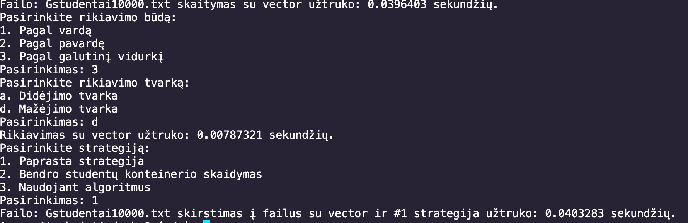  |  
| Gstudentai100000.txt   |       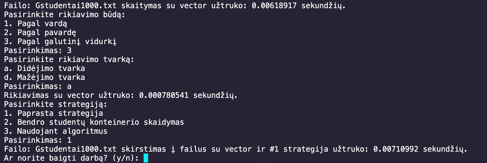  |   
| Gstudentai1000000.txt  |       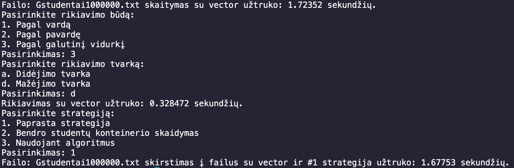  |   
| Gstudentai10000000.txt |         |    

|        FAILAS          |               LIST              |
|------------------------|---------------------------------|
| Gstudentai1000.txt     |     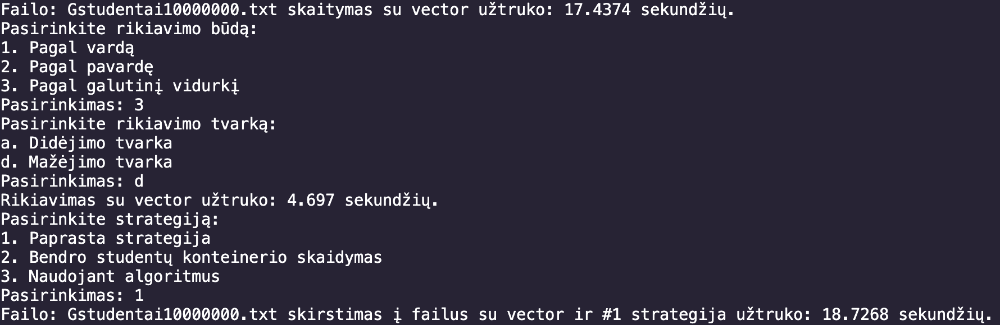    |   
| Gstudentai10000.txt    |     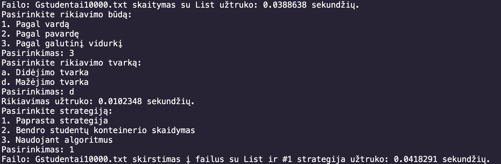    |   
| Gstudentai100000.txt   |     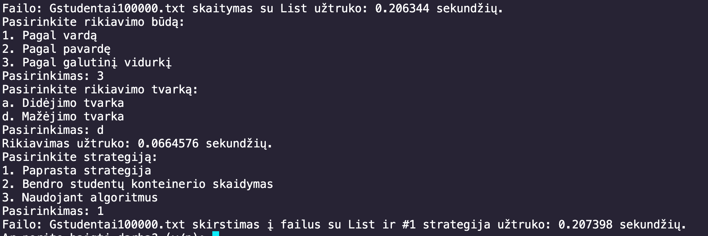    |   
| Gstudentai1000000.txt  |     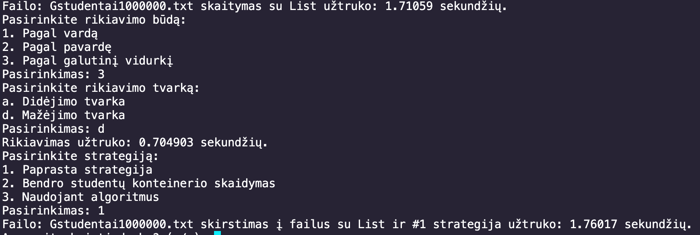    |   
| Gstudentai10000000.txt |     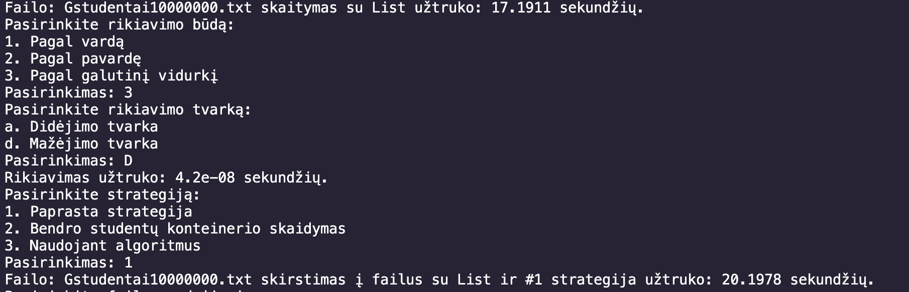    |

|        FAILAS          |              DEQUE              |
|------------------------|---------------------------------|
| Gstudentai1000.txt     |    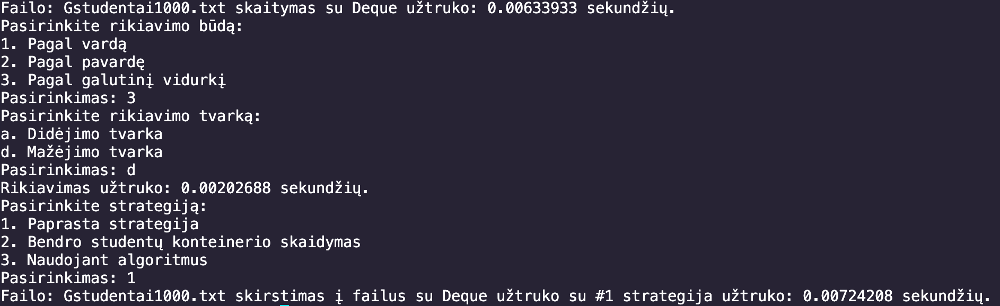    |   
| Gstudentai10000.txt    |    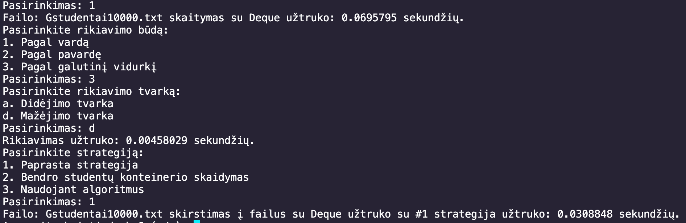    |   
| Gstudentai100000.txt   |    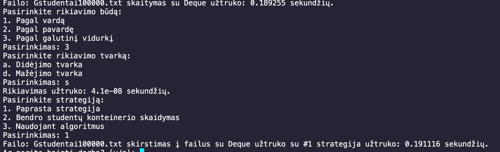    |   
| Gstudentai1000000.txt  |    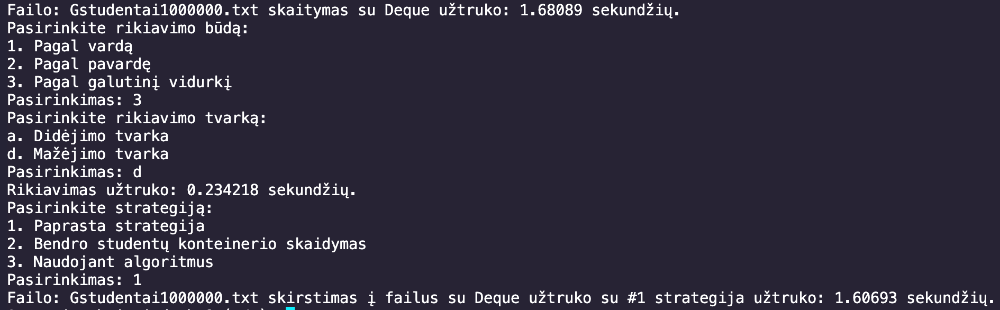    |   
| Gstudentai10000000.txt |    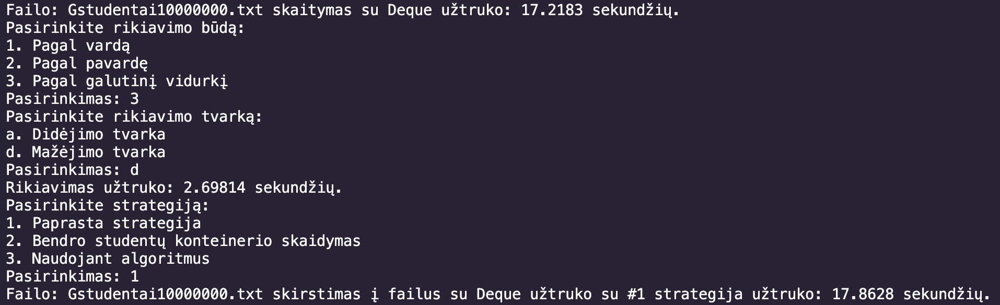    |

|        FAILAS          |       OPTIMIZUOTAS VECTOR       |
|------------------------|---------------------------------|
| Gstudentai1000.txt     |        |   
| Gstudentai10000.txt    |        |   
| Gstudentai100000.txt   |        |   
| Gstudentai1000000.txt  |        |   
| Gstudentai10000000.txt |        |

## Testavimo aplinka

- **Procesorius**: Apple M3
- **RAM**: 8GB
- **SSD**: 256GB

## Naudojimosi instrukcija

1. **Failų generavimas**:
   - Paleiskite programą ir pasirinkite failų generavimo funkciją.
   - Po failų generavimo reikės pasirinkti testai su failais.

2. **Failų darbai**:
   - Pasirinkite norimą failą iš pateikto sąrašo.
   - Pasirinkite norimą rušiavimą
   - Pasirinkite  norimą skirstymo strategiją:
   - Programa išrūšiuos studentus į „vargšiukus“ ir „kietiakus“ bei išsaugos juos atskiruose failuose.

3. **Rezultatų analizė**:
   - Peržiūrėkite sugeneruotus failus ir programos išvestį, kurioje pateikiamas veikimo laikas.

## Įdiegimo instrukcija

1. **Reikalavimai**:
   - GCC arba kitas C++ kompiliatorius su `C++17` ar naujesne versija.
   - `make` įrankis (Unix sistemose įdiegtas pagal nutylėjimą).

2. **Įdiegimas**:
   - Atsisiųskite projektą:
     git clone <https://github.com/frogg-kek/OOP>

   - Paleiskite `make` komandą:
      make

   - Sukurtas vykdomasis failas bus pavadintas `kursiokai`.

3. **Paleidimas**:
   - Paleiskite programą:
     ./kursiokai

4. **Valymas**:
     make clean